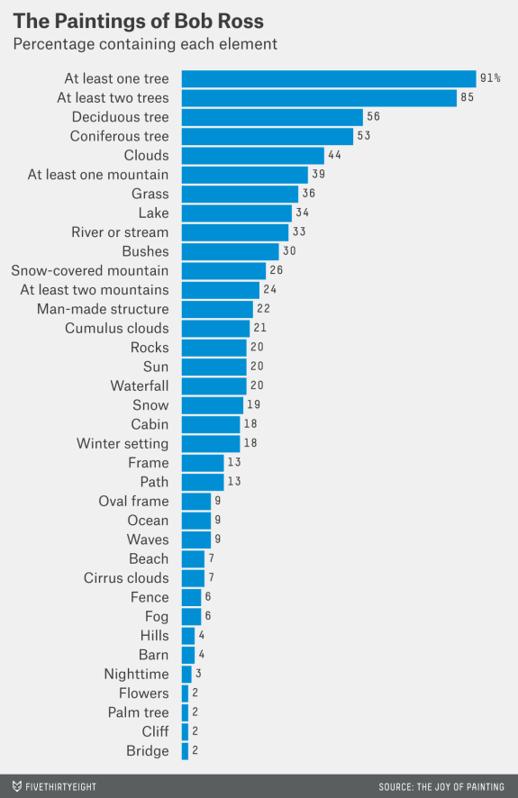

```{r, include = FALSE}
knitr::opts_chunk$set(
  collapse = TRUE,
  comment = "#>", 
  fig.align = "center",
  out.width = "75%", 
  warning = FALSE, 
  message = FALSE
)
```
<!-- Baris kode di atas merupakan pengaturan untuk dokumen R Markdown dan tidak akan tercetak pada berkas dokumen akhir -->

## Selayang pandang

Berkas dokumen yang sedang Anda baca ini disebut dengan R Markdown. Di dalam dokumen R Markdown Anda dapat melakukan tiga hal esensial sekaligus, yaitu :

1. Menuliskan kode pemrograman untuk melakukan analisis
2. Menjalankan atau mengeksekusi kode pemrograman tersebut
3. Memberikan teks narasi dan interpretasi akan hasil analisis

Manfaat yang didapatkan dengan menggunakan R Markdown adalah Anda tidak perlu lagi menggunakan berbagai perangkat lunak dalam membuat laporan analisis data. Pekerjaan Anda akan menjadi jauh lebih mudah apabila suatu saat terjadi pemutakhiran data yang menyebabkan perlunya revisi analisis data dan penulisan laporan. Oleh karena itu, dalam pelatihan singkat ini dan seterusnya Anda diharapkan untuk terus menggunakan R Markdown dalam melakukan analisis dan pelaporan.

Bagaimana cara melakukan pengaturan teks di dalam berkas dokumen R Markdown? Pengaturan teks di dokumen R Markdown dapat dilakukan dengan menggunakan sintaks Markdown. Silakan klik menu "Help -- Markdown Quick Reference" di RStudio untuk melihat sontekan cara pengaturan teks menggunakan sintaks Markdown. Selanjutnya buatlah penomoran dan pengaturan untuk teks di bawah ini!

Kalimat ini tercetak tebal
Kalimat ini tercetak miring
Kalimat ini berisi tautan https://www.markdownguide.org/getting-started

Selain teks narasi seperti yang telah Anda baca hingga pada kalimat ini, Anda juga dapat menuliskan kode pemrograman di dokumen R Markdown. Namun untuk membedakan antara teks biasa dengan kode pemrograman diperlukan suatu blok yang disebut sebagai *chunk* ). Suatu *chunk* ditandai dengan adanya tiga *backticks* "`" pada awal dan akhir baris kode pemrograman seperti ditunjukan dalam contoh berikut:

```
tulis kode pemrograman
pada bagian ini
```

Selanjutnya untuk menegaskan bahasa pemrograman apa yang digunakan dan akan dieksekusi dalam suatu *chunk*, Anda harus menambahkan penanda "{bahasa_pemrograman}" tepat setelah penanda *backticks* di awal *chunk*. R Markdown mendukung dan dapat mengeksekusi beberapa jenis bahasa pemrograman selain R, misalnya Python, Julia, C, Fortran, SQL, dan Shell script. Dalam contoh berikut menunjukan penggunaan bahasa pemrograman R di dalam suatu *chunk*. Jalankan kombinasi kibor "Ctrl + Enter" untuk mengeksekusi baris kode dalam *chunk*!

```{r}
"I stand for data journalism" # Membuat data berupa string
hari_ini <- Sys.Date() # Menjalankan sebuah fungsi untuk mengetahui tanggal hari ini dan kemudian menyimpannya sebagai obyek bernama 'hari_ini'. Tanda `<-` yang bertindak sebagai 'assignment operator'
hari_ini # mencetak isi obyek 'hari_ini' pada layar
head(mtcars) # melihat 6 baris pertama dari data mtcars, mtcars adalah data bawaan yang tersedia di R
```

Kombinasi kibor "Ctrl + Alt + I" dapat Anda gunakan untuk membuah *chunk* dengan bahasa pemrograman R. Buatlah *chunk* baru berisi kode pemrograman R sebagai berikut!

filled.contour(volcano,
               color.palette = terrain.colors, 
               plot.title = title("Topografi Gunung Maunga Whau"), 
               key.title = title("Tinggi\n(meter)"))

Penting untuk dicatat bahwa R Markdown bukanlah berkas dokumen final. R Markdown berperan sebagai dokumen perantara untuk memproduksi dokumen final dengan berbagai format, misalnya dokumen teks biasa, salindia presentasi, laman web, atau bahkan aplikasi web interaktif. Beberapa ekstensi dokumen final yang dapat dihasilkan diantaranya adalah html, md, pdf, docx, odt, dan tex. Anda dapat memproduksi dokumen final dengan cara klik tombol "Knit" atau kombinasi "Ctrl + Shift + K". Silakan jalankan kombinasi kibor tersebut setelah Anda menyelesaikan modul ini.

## Fungsi dan paket

Dalam bahasa pemrograman R segala sesuatu dilakukan dengan menggunakan fungsi. Sederhananya sebuah fungsi memiliki tugas untuk mengolah suatu *input* menjadi *output*. Pada bagian di atas Anda telah diperkenalkan dengan beberapa fungsi yaitu `Sys.Date()`, `head()`, dan `filled.contour()`. Anda dapat mengetahui tujuan dan cara penggunaan dari suatu fungsi dengan menjalankan `?nama_fungsi` atau `help(nama_fungsi)` pada konsol RStudio.

Di bawah ini merupakan beberapa fungsi dasar yang dapat Anda gunakan untuk mengolah obyek bernama `iris` sebagai *input*. Buatlah catatan singkat mengenai kegunaan dari setiap fungsi yang digunakan!

```{r}
print(iris) # Mencetak data pada layar, Anda juga dapat langsung menggunakan `iris` untuk mencetak data pada layar
dim(iris) # ___
str(iris) # ___
colnames(iris) # ___
head(iris) # ___
head(iris, 10) # ___
tail(iris) # ___
tail(iris, 10) # ___
summary(iris) # ___
iris$Sepal.Length # ___
class(iris$Species) # ___
length(iris$Petal.Width) # m___
unique(iris$Species) # ___
mean(iris$Sepal.Length) # ___
sd(iris$Sepal.Length) # ___
median(iris$Sepal.Width) # ___
sum(iris$Petal.Length) # ___
plot(iris) # ___
```

Meskipun R telah memiliki banyak fungsi bawaan yang sangat bermanfaat, tidak jarang Anda memerlukan fungsionalitas lain yang tidak tersedia langsung di R. Di bahasa pemrograman R terdapat sistem ekstensi yang disebut sebagai paket. Anda dapat melakukan banyak hal dan berbagai tujuan dengan cara memasang paket yang sesuai. Terdapat berbagai sumber repositori tempat paket-paket tersebut tersimpan secara daring, diantaranya adalah CRAN (Comprehensive R Archive Network), GitHub, dan Bioconductor.

Anda dapat memasang paket yang berasal dari CRAN dengan menggunakan fungsi `install.packages("nama_paket")`. Pada RStudio Anda juga dapat melakukan hal tersebut melalui menu "Tools-Install Packages". Sekarang cobalah pasang paket "`readr`", "`ggplot2`", dan "`remotes`"!

Pada prosedur di atas Anda telah berhasil memasang paket yang berasal dari Comprehensive R Archive Network (CRAN). Namun bagaimana jika Anda juga ingin memasang paket yang tidak berasal dari CRAN? Contohnya Anda ingin memasang paket yang tersedia dari GitHub pada di https://github.com/yonghah/esri2sf. Hal tersebut dapat dilakukan dengan menggunakan fungsi dari paket `remotes` yang telah Anda pasang. Jalankanlah baris kode berikut pada konsol RStudio Anda!

```{r, eval = FALSE}
remotes::install_github("yonghah/esri2sf")
```

Penting untuk diingat bahwa Anda harus mengaktifkan paket terlebih dahulu setiap memulai sesi analsisis untuk dapat menggunakan fungsi-fungsi yang terdapat pada paket tersebut. Hal tersebut dapat dilakukan dengan menggunakan fungsi `library(nama_paket)`.

## Bob Ross

Dalam pelatihan singkat ini Anda diminta untuk melakukan analisis terhadap lukisan Bob Ross yang dihimpun dari acara "The Joy of Painting". Tugas Anda adalah untuk mencoba membuat ulang grafik yang terdapat dalam laman https://fivethirtyeight.com/features/a-statistical-analysis-of-the-work-of-bob-ross/.

```{r}

```

Data elemen lukisan Bob Ross tersedia sebagai berkas CSV dengan nama 'bob-ross-elements.csv' di dalam subdirektori 'data' RStudio Project ini. Bagaimana cara untuk mengimpor berkas CSV tersebut sehingga dapat diolah dan dianalisis menggunakan R? Anda dapat memanfaatkan fungsi `read_csv()` dari paket `readr` untuk melakukan hal tersebut. Sekarang aktifkanlah paket `readr` terlebih dahulu dan selanjutnya silakan impor 'bob-ross-elements.csv' sebagai obyek R bernama 'bob_ross_elements'! Isilah bagian "___" dengan jawaban yang tepat.

```{r}
library(___)

___ <- read_csv("___/bob-ross-elements.csv")
```

Sekarang cetaklah data tersebut pada layar dan lakukanlah inspeksi dengan menggunakan fungsi `str()` atau `summary()`. Ada berapa baris dan kolom yang terdapat pada data tersebut? Apa saja nama kolom yang tersedia?

```{r}
___
str(___)
___(bob_ross_elements)
```

Selamat Anda telah berhasil melakukan impor dan inspeksi data! Anda sukses mengetahui bahwa data `bob_ross_elements` memiliki tiga kolom, yaitu:

+ Kolom `elements` berisi informasi elemen-elemen apa saja yang terdapat dalam lukisan
+ Kolom `n` berisi informasi frekuensi penggunaan suatu element sepanjang acara "The Joy of Painting"
+ Kolom `pct` berisi informasi persentase penggunaan suatu element sepanjang acara "The Joy of Painting"

Setelah memastikan bahwa struktur data telah sesuai kaidah ["tidy data"](http://r4ds.had.co.nz/tidy-data.html), selanjutnya Anda dapat memulai pembuatan grafik untuk menyajikan data dalam bentuk visual. Data `bob_ross_elements` telah dipersiapkan agar sesuai dengan kaidah "tidy data" sehingga dapat langsung dipergunakan untuk membuat grafik.

> **_For experienced user:_** `bob_ross_elements` merupakan data yang telah diolah dari dataset awal "elements-by-episode.csv". Berkas data tersebut tersedia secara daring di "https://raw.githubusercontent.com/fivethirtyeight/data/master/bob-ross/elements-by-episode.csv". Dapatkah Anda melakukan pengolahan dataset awal tersebut sehingga menjadi data `bob_ross_elements`? Pergunakanlah fungsi `identical()` untuk memastikan kesamaan antara data Anda tersebut dengan `bob_ross_elements` yang telah tersedia!

Sekarang Anda akan diminta untuk membuat visualisasi data `bob_ross_elements` sehingga menyerupai grafik yang tersaji dalam laman FiveThirthyEight.com di atas. Dalam bahasa pemrograman R terdapat berbagai sistem untuk membuat grafik, namun dalam studi kasus ini kita hanya akan menggunakan sistem "ggplot" dari paket `ggplot2()`. Karena kita akan menggunakan berbagai fungsi dari paket `ggplot()`, maka Anda dipersilakan untuk mengaktifkan paket tersebut terlebih dahulu.

```{r}
___
```

Dalam sistem "ggplot" suatu grafik dibangun atas beberapa lapisan (*layer*). Lapisan pertama adalah pondasi atau kanvas yang dibuat dengan menggunakan fungsi `ggplot()`. Di dalam kanvas tersebut Anda dapat menentukan elemen apa saja yang akan direpresentasikan oleh sumbu x dan sumbu y dengan menggunakan fungsi `aes()`. Kemudian di atas kanvas tersebut Anda dapat menentukan obyek geometris apa saja yang akan ditambahkan untuk membuat grafik dengan menggunakan `+ geom_something()`. Contohnya jika Anda ingin membuat sebuah *scatterplot*, maka obyek geometris yang perlu ditambahkan adalah titik/lingkaran (`geom_point()`) untuk menghubungkan antara nilai pada sumbu x dan sumbu y. Anda dapat membaca sontekan mengenai obyek-obyek geometris apa saja yang tersedia di `ggplot2()` dengan cara klik menu "Help - Cheatsheets - Data Visualization with ggplot2" pada RStudio.

Pada *chunk* berikut tersedia baris kode untuk membuat grafik dasar `bob_ross_elements`. Menurut Anda hal-hal apa sajakah yang penting diperhatikan untuk membuat grafik dasar?

```{r}
ggplot(data = bob_ross_elements, aes(x = element, y = pct)) +
  geom_col()
```

Selamat Anda telah berhasil membuat grafik menggunakan `ggplot2`! Grafik dasar tersebut pada prinsipnya telah dapat memvisualisasikan informasi yang terdapat pada data `bob_ross_elements`. Namun pertanyaannya adalah apakah informasi yang terdapat pada grafik tersebut dapat dengan mudah dibaca dan dicerna oleh pembaca?

Anda tentu menyadari ada banyak hal yang harus dilakukan untuk membuat grafik tersebut menjadi lebih menarik serta mudah dimengerti. Sekarang tugas kita adalah melakukan kostumisasi grafik tersebut sehingga dapat menyerupai grafik di bawah ini:

```{r}

```

Berikut merupakan beberapa poin penting dan tugas kostumisasi grafik yang akan dikerjakan:

+ Menukar posisi sumbu x dan sumbu y
+ Mengurutkan posisi elemen dari persentase terbesar hingga terkecil
+ Memberikan warna pada grafik batang. Contoh: "dodgerblue"
+ Menambahkan judul, subjudul, dan keterangan gambar
+ Menghapus nama sumbu x dan sumbu y
+ Menambahkan teks berupa nilai presentase setiap elemen
+ Menghapus garis penanda sumbu
+ Memberikan warna latar grafik
+ Modifikasi fonta dan warna teks

```{r}
ggplot(data = ___, aes(x = ___, y = pct)) +
  geom_col()
```

Selamat Anda telah berhasil membuat dan melakukan kostumisasi pada grafik! Silakan berpartisipasi dalam program pekanan ["Kamis Data"](https://github.com/indo-r) yang diselenggarakan oleh [**Komunitas R Indonesia**](https://t.me/GNURIndonesia) jika Anda ingin berlatih dan belajar mengenai bahasa pemrograman R untuk analisis data.

Sekarang silakan Anda klik tombol "Knit" pada RStudio (atau jalankan kombinasi kibor "Ctrl + Shift + K") untuk memproduksi dokumen final berupa laman html!